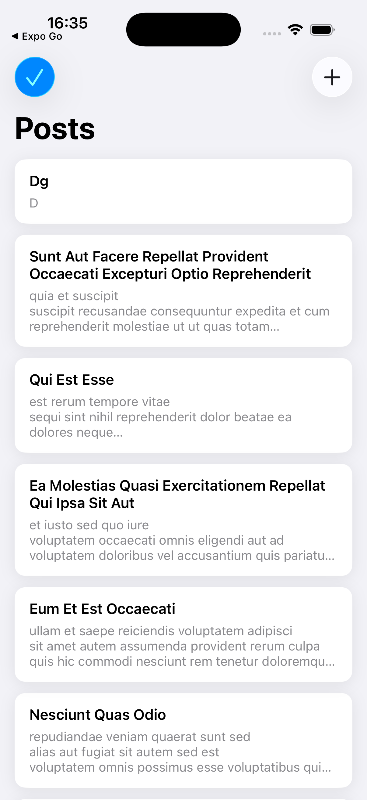
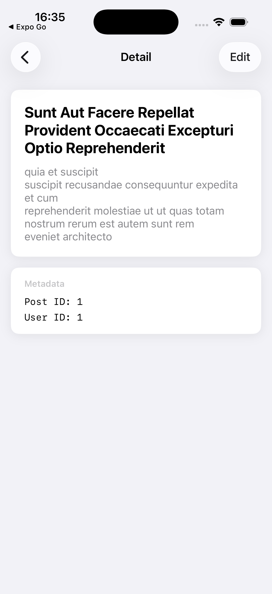
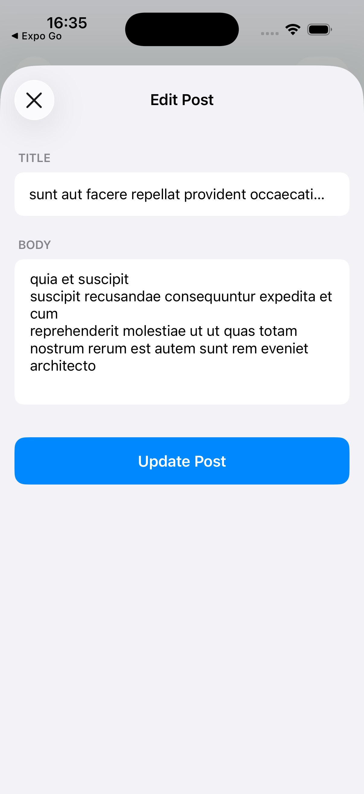
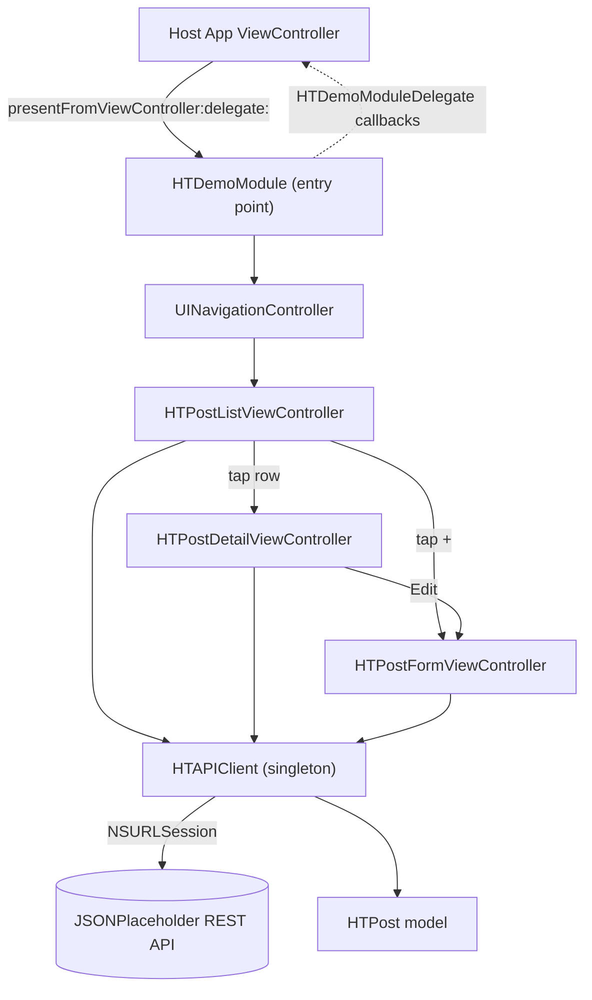

# Objective-C Demo Feature Module

A self-contained Objective-C feature module demonstrating how to quickly add a polished demo feature with REST API integration to an existing UIKit app.

## Demo


List -> Detail -> Create/Edit form, all driven by `NSURLSession` against a live REST API.

## What This Demonstrates

- Adding a complete feature module to an existing Objective-C iOS app
- REST API integration using NSURLSession (no third-party dependencies)
- Three key screens: List, Detail, and Create/Edit Form
- Clean module architecture with a single entry point

## Screenshots

| Post List | Post Detail | Edit Post |
|:---------:|:-----------:|:---------:|
|  |  |  |

## Screens

1. **Post List** - UITableView fetching data from JSONPlaceholder API, pull-to-refresh, loading states
2. **Post Detail** - Detail view with card-based layout, edit capability
3. **Post Form** - Create/edit form with field validation, simulated POST/PUT requests

## Architecture



- **HT prefix** - All classes use the HT (Hau Tran) prefix
- **Single entry point** - `HTDemoModule` presents the entire feature from any view controller
- **Delegate protocol** - `HTDemoModuleDelegate` for host app communication
- **100% programmatic UI** - No storyboards, all Auto Layout in code
- **NSURLSession** - No CocoaPods, no SPM, zero dependencies

## Integration

```objc
#import "HTDemoModule.h"
#import "HTDemoModuleDelegate.h"

// Present the module from any view controller
[HTDemoModule presentFromViewController:self delegate:self];
```

## Key Patterns

- NSURLSession-based API client with completion blocks
- Singleton pattern for shared API client
- NS_ASSUME_NONNULL_BEGIN/END for nullability annotations
- NS_DESIGNATED_INITIALIZER for proper init chains
- UITableView with delegate/datasource and cell reuse
- UIRefreshControl for pull-to-refresh
- Block-based callbacks for component communication
- Forward declarations in headers, imports in implementations

## Export as Framework

To package the module as a reusable `.framework` for other projects:

### 1. Create a Framework Target in Xcode

1. Open `DemoModule.xcodeproj`
2. File > New > Target > Framework (iOS)
3. Name it `HTDemoModule`
4. Set deployment target to iOS 15.0+
5. Add all files under `DemoModule/Module/` to the framework target

### 2. Configure Public Headers

In Build Phases > Headers, set these as **Public**:

- `HTDemoModule.h`
- `HTDemoModuleDelegate.h`
- `HTPost.h`

All other headers stay **Project** (internal to the framework).

### 3. Create Umbrella Header

Add an umbrella header `HTDemoModule.h` to the framework target:

```objc
#import <UIKit/UIKit.h>

FOUNDATION_EXPORT double HTDemoModuleVersionNumber;
FOUNDATION_EXPORT const unsigned char HTDemoModuleVersionString[];

#import <HTDemoModule/HTDemoModule.h>
#import <HTDemoModule/HTDemoModuleDelegate.h>
#import <HTDemoModule/HTPost.h>
```

### 4. Build the Framework

```bash
# Build for simulator
xcodebuild -project DemoModule.xcodeproj \
  -scheme HTDemoModule -sdk iphonesimulator \
  -configuration Release build

# Build for device
xcodebuild -project DemoModule.xcodeproj \
  -scheme HTDemoModule -sdk iphoneos \
  -configuration Release build

# Create XCFramework (universal)
xcodebuild -create-xcframework \
  -framework build/Release-iphoneos/HTDemoModule.framework \
  -framework build/Release-iphonesimulator/HTDemoModule.framework \
  -output build/HTDemoModule.xcframework
```

## Import Framework into Your Project

### Option A: XCFramework (Recommended)

1. Drag `HTDemoModule.xcframework` into your project navigator
2. Select your app target > General > Frameworks, Libraries, and Embedded Content
3. Ensure `HTDemoModule.xcframework` is set to **Embed & Sign**

### Option B: Manual .framework

1. Drag `HTDemoModule.framework` into your project
2. Add it to **Embedded Binaries** and **Linked Frameworks**

### Option C: Source Files (No Framework)

Copy the entire `Module/` folder into your project and add all files to your target.

### Usage in Host App

```objc
#import <HTDemoModule/HTDemoModule.h>
#import <HTDemoModule/HTDemoModuleDelegate.h>

@interface ViewController () <HTDemoModuleDelegate>
@end

@implementation ViewController

- (IBAction)showDemo:(id)sender {
    [HTDemoModule presentFromViewController:self delegate:self];
}

#pragma mark - HTDemoModuleDelegate

- (void)demoModuleDidFinish {
    NSLog(@"Module dismissed");
}

- (void)demoModuleDidCreatePost:(HTPost *)post {
    NSLog(@"Created: %@", post.title);
}

- (void)demoModuleDidUpdatePost:(HTPost *)post {
    NSLog(@"Updated: %@", post.title);
}

@end
```

## Requirements

- iOS 15.0+
- Xcode 15.0+

## Build

```bash
xcodebuild -project DemoModule.xcodeproj \
  -scheme DemoModule -sdk iphonesimulator \
  -destination 'platform=iOS Simulator,name=iPhone 16' build
```
